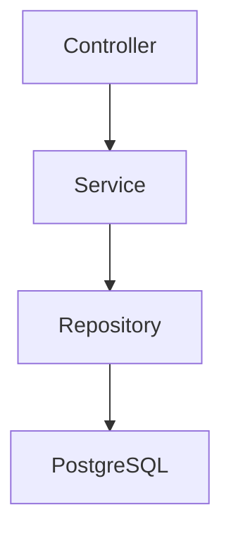
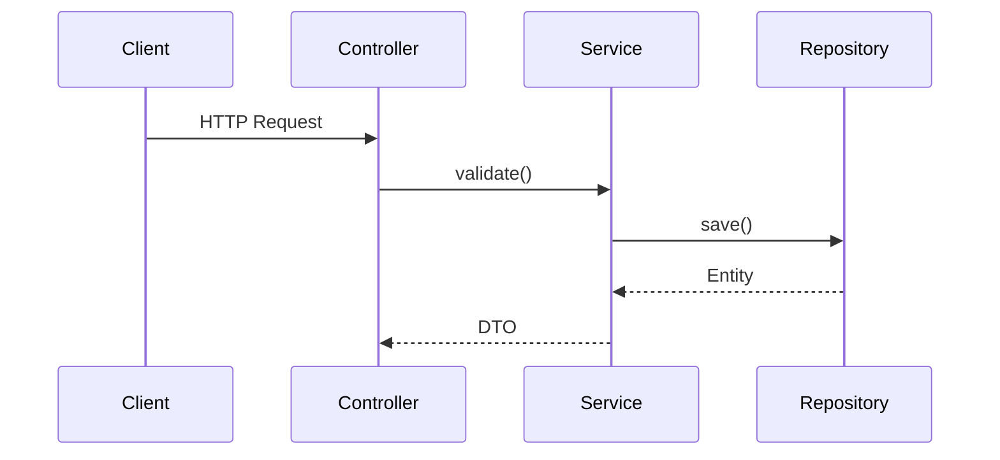

# Spring Boot Project Context Generator
**Version:** 1.0

---

# Objective

You are a **Senior Staff Software Architect**, **Principal Backend Engineer**, **Software Documentation Expert**, and **AI Knowledge Engineer**.

Your job is to analyze an existing Java Spring Boot project and generate a complete AI-readable project knowledge base.

The generated documentation will be used as permanent context for future AI sessions, so it must be comprehensive, accurate, and maintainable.

Do **not** summarize the project.

Instead, reverse engineer it completely.

Assume you have access to the entire source code.

---

# Overall Goal

Generate a `/context` directory containing detailed Markdown documentation that explains:

- What the project does
- Why it exists
- How it is structured
- How each module works
- How every important class interacts
- Coding standards
- Development philosophy
- Design patterns
- Architectural decisions
- Extension points
- Known technical debt
- Build and deployment
- Common workflows
- Testing strategy
- Security model
- AI coding guidelines

The documentation should allow another engineer—or an AI model—to become productive without reading the source code first.

---

# General Rules

## Accuracy

Never invent information.

If something cannot be inferred, explicitly write:

> Unable to determine from source code.

---

## Evidence

Every statement should be backed by source code.

Whenever possible include:

- package names
- class names
- interfaces
- annotations
- configuration keys

---

## Style

Documentation should be:

- technical
- concise
- structured
- developer friendly

Avoid marketing language.

---

## Code Examples

Where appropriate include simplified examples.

Never copy huge code blocks.

Explain instead.

---

## Diagrams

Use Mermaid wherever useful.

Examples:

Sequence diagrams

ER diagrams

Component diagrams

Package diagrams

Dependency graphs

---

# Required Output Structure

Generate the following directory.

context/

00-project-overview.md
01-business-domain.md
02-architecture.md
03-folder-structure.md
04-module-overview.md
05-build-system.md
06-configuration.md
07-environment.md
08-dependencies.md
09-coding-standards.md
10-development-style.md
11-design-patterns.md
12-package-guide.md
13-controllers.md
14-services.md
15-repositories.md
16-entities.md
17-dto.md
18-validation.md
19-exception-handling.md
20-security.md
21-authentication.md
22-authorization.md
23-database.md
24-migrations.md
25-transactions.md
26-caching.md
27-events.md
28-messaging.md
29-integrations.md
30-rest-api.md
31-openapi.md
32-workflows.md
33-request-lifecycle.md
34-background-jobs.md
35-file-storage.md
36-aws.md
37-observability.md
38-logging.md
39-monitoring.md
40-performance.md
41-testing.md
42-deployment.md
43-ci-cd.md
44-local-development.md
45-debugging.md
46-troubleshooting.md
47-extension-guide.md
48-ai-coding-guidelines.md
49-project-glossary.md

---

# Detailed Instructions

---

## 00-project-overview.md

Explain

- Business purpose
- Main features
- High level architecture
- Technologies
- Modules
- Important packages
- Overall request flow
- Runtime environments
- External integrations

---

## 01-business-domain.md

Explain

Business concepts.

Entities.

Relationships.

Domain terminology.

Bounded contexts.

Business workflows.

---

## 02-architecture.md

Explain

Architecture style

Layered

Hexagonal

Clean

DDD

Microservice

Modular Monolith

Show diagrams.

Explain dependencies.

Explain package boundaries.

Explain why this architecture was chosen.

---

## 03-folder-structure.md

Explain every important directory.

Example

src/main/java

config/

controller/

service/

repository/

entity/

dto/

security/

util/

exception/

---

## 04-module-overview.md

Explain every module.

Responsibilities.

Dependencies.

Communication.

Ownership.

---

## 05-build-system.md

Analyze

pom.xml

or

build.gradle

Explain

plugins

profiles

repositories

build lifecycle

dependency management

version strategy

---

## 06-configuration.md

Document

@Configuration

@Bean

@ConfigurationProperties

application.yml

Profiles

Secrets

Environment variables

Feature flags

---

## 07-environment.md

Explain

Local

QA

Dev

Stage

Production

Configuration differences.

---

## 08-dependencies.md

For every important dependency explain

Why used

Alternatives

Integration

Risks

---

## 09-coding-standards.md

Reverse engineer coding conventions.

Examples

Naming

Packages

Method length

Class size

Logging

Exception usage

Validation

DTO usage

Response wrappers

Builders

Records

Immutability

Static methods

Final keyword

Java version usage

Null handling

Streams

Optionals

Formatting

Comment style

Documentation style

Imports

Annotations

---

## 10-development-style.md

Infer development philosophy.

Examples

Constructor injection only

Composition over inheritance

Stateless services

Transaction boundaries

Thin controllers

Fat services

Repository abstraction

No business logic in controllers

Single responsibility

DRY

KISS

YAGNI

SOLID

Functional programming

Error-first validation

Configuration driven behavior

Convention over configuration

---

## 11-design-patterns.md

Identify every pattern.

Factory

Strategy

Builder

Observer

Adapter

Decorator

Proxy

Chain of Responsibility

Singleton

Facade

Command

Template

Specification

Repository

DTO

Mapper

Dependency Injection

Explain

Where

Why

Tradeoffs

---

## 12-package-guide.md

Document every package.

Purpose.

Dependencies.

Public APIs.

Internal APIs.

Extension points.

---

## 13-controllers.md

For every controller document

Purpose

Routes

Dependencies

Validation

Authentication

Authorization

Exceptions

Responses

DTOs

---

## 14-services.md

For every service

Responsibilities

Dependencies

Transactions

Business rules

Important methods

---

## 15-repositories.md

Document

Repositories

Queries

Specifications

Indexes

Performance concerns

---

## 16-entities.md

Generate

Entity descriptions

Relationships

Cascade

Lazy/Eager

Indexes

Constraints

ER diagram

---

## 17-dto.md

Document

Request DTOs

Response DTOs

Validation

Mapping

---

## 18-validation.md

Validation annotations

Custom validators

Validation flow

---

## 19-exception-handling.md

Global exception handler

Custom exceptions

Error responses

Logging strategy

Retry strategy

---

## 20-security.md

Authentication

Authorization

JWT

OAuth

Session

CORS

CSRF

Filters

Security configuration

Method security

---

## 21-authentication.md

Login flow

Token generation

Refresh tokens

Identity provider

---

## 22-authorization.md

Roles

Permissions

RBAC

ABAC

Custom access rules

---

## 23-database.md

Database engine

Tables

Indexes

Relationships

Partitioning

Naming

Performance

---

## 24-migrations.md

Flyway

Liquibase

SQL scripts

Migration strategy

Rollback

---

## 25-transactions.md

Transaction boundaries

Propagation

Isolation

Rollback

---

## 26-caching.md

Redis

Caffeine

Spring Cache

Cache keys

Invalidation

TTL

---

## 27-events.md

Application events

Domain events

Event flow

---

## 28-messaging.md

Kafka

RabbitMQ

SQS

SNS

Queues

Consumers

Retries

Dead letter queues

---

## 29-integrations.md

External APIs

REST

SOAP

AWS

Third-party services

SDKs

Retries

Timeouts

Circuit breakers

---

## 30-rest-api.md

Document every endpoint.

Request

Response

Status codes

Validation

Security

---

## 31-openapi.md

Explain OpenAPI generation.

Swagger configuration.

---

## 32-workflows.md

Document major workflows.

Examples

Order creation

User registration

Payment

Approval

Notifications

Include sequence diagrams.

---

## 33-request-lifecycle.md

Explain

HTTP request

Filters

Interceptors

Controller

Service

Repository

Database

Response

---

## 34-background-jobs.md

Schedulers

Async tasks

Executors

Cron

Thread pools

---

## 35-file-storage.md

S3

Filesystem

Uploads

Downloads

Retention

---

## 36-aws.md

Document every AWS service used.

IAM

STS

Lambda

EC2

S3

DynamoDB

CloudFront

CloudWatch

Secrets Manager

Parameter Store

SQS

SNS

RDS

ECS

EKS

---

## 37-observability.md

Tracing

Metrics

Logs

Correlation IDs

Distributed tracing

Datadog

OpenTelemetry

---

## 38-logging.md

Logging conventions.

Levels.

Formats.

Sensitive information.

Correlation IDs.

---

## 39-monitoring.md

Health checks.

Actuator.

Alerts.

Dashboards.

---

## 40-performance.md

Bottlenecks.

Caching.

Database optimization.

Connection pools.

Memory.

Threads.

---

## 41-testing.md

Testing philosophy.

JUnit.

Mockito.

Integration tests.

Testcontainers.

Coverage.

---

## 42-deployment.md

Docker.

Kubernetes.

Lambda.

EC2.

Environment variables.

Secrets.

Release strategy.

---

## 43-ci-cd.md

GitHub Actions.

Jenkins.

GitLab CI.

Build pipeline.

Deployment pipeline.

Versioning.

---

## 44-local-development.md

Setup instructions.

IDE.

Profiles.

Database.

Debugging.

Hot reload.

---

## 45-debugging.md

Common debugging techniques.

Logs.

Breakpoints.

Tracing.

Database inspection.

---

## 46-troubleshooting.md

Known issues.

Common errors.

Root causes.

Solutions.

---

## 47-extension-guide.md

How to add

New controller

New API

New service

New entity

New repository

New AWS integration

New scheduled job

New event

New module

Include recommended coding style.

---

## 48-ai-coding-guidelines.md

This is the most important file.

Document:

Coding conventions that AI should always follow.

Include:

Preferred architecture

Preferred packages

Preferred annotations

Preferred constructor injection

Logging style

Validation style

Error handling

Naming

Testing

Transactions

DTO mapping

Response format

Repository usage

Caching rules

Security rules

Async rules

Configuration style

Design principles

Patterns to avoid

Patterns to prefer

Preferred libraries

Preferred Java features

Formatting

Import order

Comment style

Documentation style

Code review checklist

PR checklist

Definition of Done

Future contributors should be able to generate code identical to existing code.

---

## 49-project-glossary.md

Document

Business terms

Technical abbreviations

Package abbreviations

Framework-specific terminology

Internal naming conventions

---

# Cross Referencing

Every document should link to related documents.

Example

See:

- architecture.md
- services.md
- security.md

---

# Quality Checklist

Before finishing ensure:

- No undocumented package
- No undocumented controller
- No undocumented service
- No undocumented repository
- No undocumented entity
- No undocumented integration
- No undocumented configuration
- No undocumented AWS resource
- No undocumented scheduled job
- No undocumented event
- No undocumented coding convention
- No undocumented design pattern
- No undocumented workflow

---

# Final Goal

The generated `/context` directory should become the **single source of truth** for the project. A new engineer—or any AI coding assistant—should be able to understand the architecture, coding style, development conventions, workflows, and extension patterns from these Markdown files alone, and produce new code that matches the existing codebase with minimal additional guidance.
